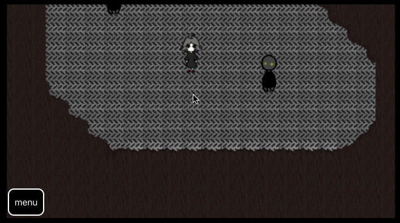

# Swift RPG

Simple game written in swift with SpriteKit.
*Work in progress*

## Document

[here](https://github.com/tasuwo/SwiftRPG/wiki)

## Screen Shot

## TODO

- ~~Move objects~~
  - ~~Collision detection management~~
  - Stop object's behavior when touch event occured
    - ~~Create `EventObject` and placement for it~~
    - ~~Tying: This realize by `EventObject`'s property~~
      - ~~*object* and related *event object*~~
        - ~~Should be able to reference *object* from *event object*~~
      - ~~*event object* and related *event listener*~~
        - ~~Should be able to reference *event listener* from *event object*~~
    - If EventObject's event was added to EventDispatchar, the EventObject should be passed to EventManager. And the listener's id should be registered to EventObject.
      - When remove listener related to EventObject, should remove listener id from the EventObject too.
    - Add `EventExecutionType` to EventObject (**Not** EventListenerType)
      - `parallel`: The event is executed in parallel with other events
      - `serial`: When the event is executed, other events are stopped while the executring.
    - Split `WalkEventListener` to parts as following
      - Route search: Generate listeners that load animation of player's one step
      - Load animation of player's one step
    - Prepare cyclic event for invoking event
      - Check cyclically if there are events on tile which is placed player
      - When found out events, execute following process depends on the `EventExecutionType`
        - `parallel`: remove `WalkEventListener` and EventListeners for object's behavior
        - `serial`: execute the event
- Loop object's behavior
- Document
- Scene transition
- Sound
- Flag management
- Battle
